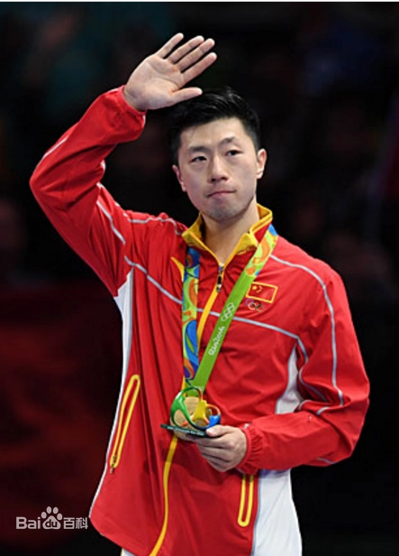

## [HOME](../README.md)

### персональная информация

Это Мэлоун.Он игрок в настольный теннис.Мой любимый спортсмен.Он родилсился в 1988 году,в Аньшань, Китай.Он Китаец, игрок в настольный теннис Китайской Народной Республики, нынешний капитан мужской сборной Китая по настольному теннису.Он первый игрок мужского пола «Супер Большого шлема» в истории настольного тенниса, выигравший Олимпийские игры, чемпионаты мира, чемпионаты мира, Азиатские игры, чемпионаты Азии, Кубок Азии, финалы тура, национальные игры Китая и национальные чемпионаты в одиночном разряде. , является первым игроком в настольный теннис в истории настольного тенниса, который успешно выиграл олимпийскую золотую медаль в мужском одиночном разряде и имеет наибольшее количество олимпийских золотых медалей (оборудование). Он является первым игроком в настольный теннис в истории мужского настольного тенниса, у которого есть турнир Большого шлема с двойным кругом. Он выиграл 27 чемпионатов мира только в трех крупных соревнованиях. Этот рекорд все еще сохраняется. В настоящее время он является игроком номер один в мире настольного тенниса, а также третьим в истории, выигравшим три чемпионата мира подряд среди мужчин. титулы в одиночном разряде после Виктора Борнау и Чжуан Цзэдуна. Он также является номером один в мире среди мужчин в одиночном разряде ITTF по наибольшему количеству месяцев и самой длинной серии рекордов.
